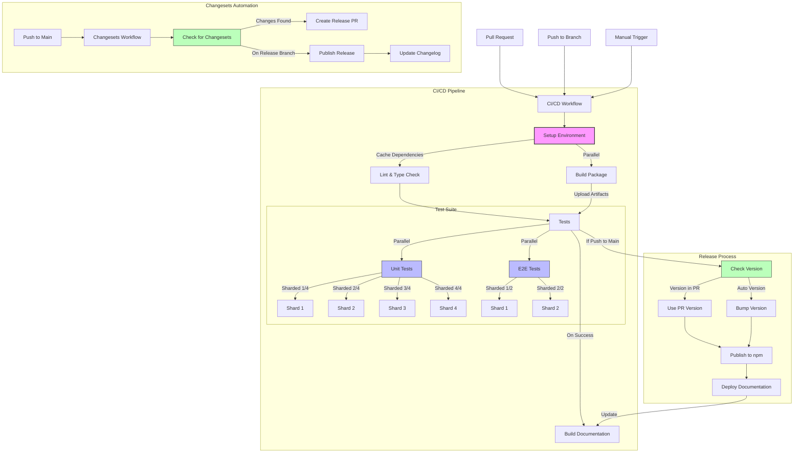

# CI/CD Pipeline

This document describes the CI/CD pipeline for the Svelte LogViewer project.

## Workflow Diagram

## Workflow Files

- `.github/workflows/ci.yml`: Main CI/CD pipeline
- `.github/workflows/changesets.yml`: Automated versioning and publishing
- `.github/workflows/setup.yml`: Reusable setup workflow

## Key Features

1. **Reusable Setup**: Common setup steps are extracted into a reusable workflow
2. **Enhanced Caching**: Dependencies and build artifacts are cached for faster builds
3. **Parallel Testing**: Tests are run in parallel with sharding for faster feedback
4. **Automated Versioning**: Changesets is used for automated semantic versioning
5. **Documentation Automation**: Storybook is built and deployed automatically

## How It Works

1. When a pull request is opened or updated, the CI/CD pipeline runs:

   - Linting and type checking
   - Building the package
   - Running unit tests and E2E tests in parallel

2. When changes are pushed to the main branch:
   - The CI/CD pipeline runs as above
   - The Changesets workflow checks for changesets
   - If changesets are found, a release PR is created or the changes are published
   - Documentation is built and deployed

## Manual Triggers

Both workflows can be triggered manually:

- The CI/CD pipeline can be triggered with `workflow_dispatch`
- The Changesets workflow can be triggered by pushing to the main branch
